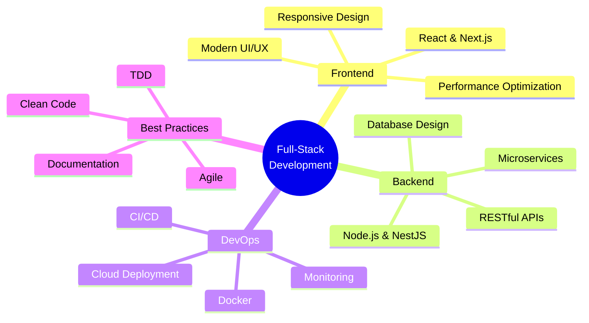

<div align="center">
  
<!-- Você pode criar seu header personalizado em: https://leviarista.github.io/github-profile-header-generator/ -->
<!-- Após criar, faça upload para seu repositório e substitua a URL abaixo -->


</div>

<div align="center">
  
[](https://git.io/typing-svg)

</div>

---

## 👨‍💻 About Me

```typescript
const matheus = {
    location: "Brasília, DF - Brazil 🇧🇷",
    role: "Full-Stack Developer",
    focus: ["Scalable Architecture", "Microservices", "Modern Web"],
    currentlyWorking: "Full-Stack Projects with React & NestJS",
    techStack: {
        frontend: ["React", "Next.js", "TypeScript", "TailwindCSS"],
        backend: ["Node.js", "NestJS", "Express"],
        databases: ["PostgreSQL", "MongoDB"],
        tools: ["Docker", "Git", "VS Code"]
    },
    interests: ["Clean Code", "System Design", "Performance Optimization"],
    contact: "matheus.gui.pgr@gmail.com"
};
```

---

## 🛠️ Tech Stack

<div align="center">

### Frontend


### Backend


### Database & DevOps


</div>

---

## 📊 GitHub Analytics

<div align="center">
  
  
</div>

<div align="center">
  
</div>

<div align="center">
  
</div>

---

## 🚀 Featured Projects

<div align="center">

| 🎯 Project | 📝 Description | 🔧 Tech Stack | ⭐ Stars |
|:-----------|:---------------|:--------------|:---------|
| [**midia-repo**](https://github.com/manguima/midia-repo) | Advanced media management system | TypeScript, React |  |
| [**robo-consulta**](https://github.com/manguima/robo-consulta) | Automation bot for legal consultations | TypeScript, Python |  |
| [**clinica-dash**](https://github.com/manguima/clinica-dash) | Clinical management dashboard | TypeScript, Next.js |  |
| [**IA_consulta**](https://github.com/manguima/IA_consulta) | AI-powered consultation system | TypeScript, NestJS |  |
| [**wedding-web**](https://github.com/manguima/wedding-web) | Wedding management platform | TypeScript, React |  |
| [**radio-frontend**](https://github.com/manguima/radio-frontend) | Radio streaming platform | TypeScript, Next.js |  |

</div>

---

## 💼 What I Do

<div align="center">



</div>

- ⚡ **Full-Stack Development** – Building complete web applications from conception to deployment
- 🏗️ **Scalable Architecture** – Designing robust systems that grow seamlessly with demand
- 🔧 **Microservices** – Implementing distributed architectures for better scalability and maintainability
- 🎨 **Responsive Design** – Creating beautiful, intuitive, and accessible user interfaces
- 📱 **Modern Web Apps** – Leveraging cutting-edge technologies and industry best practices
- 🔐 **Security First** – Implementing secure authentication, authorization, and data protection

---

## 📈 Activity & Contributions

<div align="center">


### 🏆 2025 Achievements


</div>

---

## 🤝 Let's Connect

<div align="center">

[](https://www.linkedin.com/in/matheus-guima/)
[](https://github.com/manguima)
[](mailto:matheus.gui.pgr@gmail.com)
[](#)

</div>

---

<div align="center">

### 💡 Open to Collaboration

I'm always interested in working on innovative projects, contributing to open source, and connecting with fellow developers. Feel free to reach out!

### ⭐ Show Some Love

If you find my work interesting or helpful, please consider giving a star to my repositories!


**Made with ❤️ and ☕ by Matheus Guimarães**

</div>
